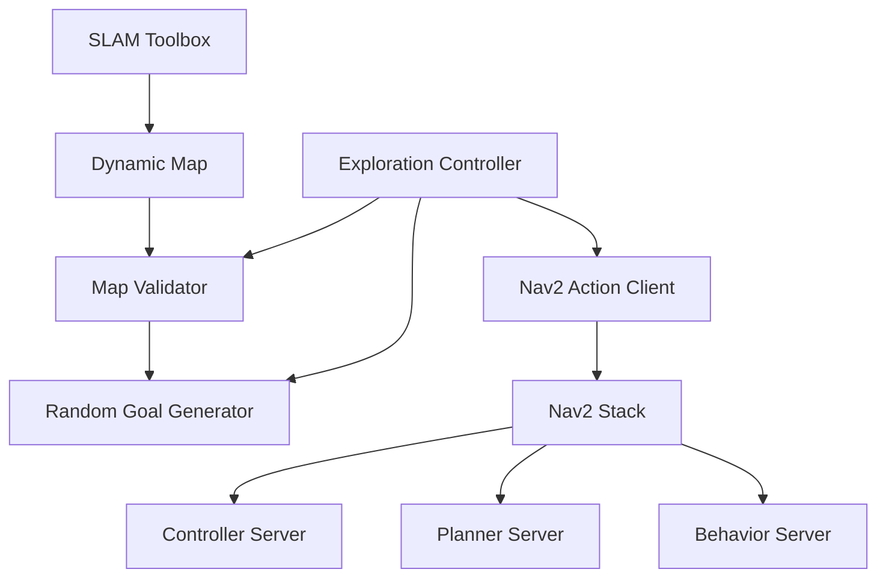

# Random Explorer Bot - Autonomous Navigation with Nav2

[](https://docs.ros.org/en/humble/)
[](https://isocpp.org/)
[](https://opensource.org/licenses/Apache-2.0)
[](https://gazebosim.org/)
[](https://docs.nav2.org/)

## Overview

An Autonomous Exploration System built with ROS2 and Nav2 that enables robots to continuously explore unknown environments. The system generates random navigation goals within specified boundaries, validates them against the current SLAM map, and handles unreachable goals gracefully with automatic timeout and retry mechanisms.

### Key Features

- **Dynamic Mapping**: Real-time map generation using SLAM Toolbox
- **Random Goal Generation**: Smart goal selection with map validation and distance constraints
- **Continuous Exploration**: Autonomous navigation without human intervention
- **Goal Timeout Handling**: Automatic cancellation of unreachable goals
- **Intelligent Obstacle Avoidance**: Dynamic collision prevention using Nav2
- **Visual Feedback**: Colorful goal markers and progress tracking in RViz

## System Architecture


### Component Overview

| Component | Responsibility |
|-----------|---------------|
| **Exploration Controller** | Main orchestration, state management, goal timeout handling |
| **Random Goal Generator** | Boundary-aware random points with min/max distance constraints |
| **Map Validator** | Collision-free goal validation with circular clearance check |
| **Nav2 Stack** | Path planning, obstacle avoidance |
| **SLAM Toolbox** | Real-time environment mapping |

## Prerequisites

### System Requirements

- **OS**: Ubuntu 22.04 LTS
- **ROS2**: Humble Hawksbill
- **RAM**: 4GB minimum (8GB recommended)

### Required Dependencies
```bash
sudo apt update
sudo apt install -y \
  ros-humble-desktop-full \
  ros-humble-navigation2 \
  ros-humble-nav2-bringup \
  ros-humble-slam-toolbox \
  ros-humble-turtlebot3* \
  ros-humble-gazebo-ros-pkgs \
  python3-colcon-common-extensions
```

## Quick Start

### Environment Setup
```bash
echo "export TURTLEBOT3_MODEL=burger" >> ~/.bashrc
source ~/.bashrc
```

### Build
```bash
cd ~/nav2_explorer_ws
colcon build --packages-select random_explorer_bot
source install/setup.bash
```

### Launch

**Terminal 1 - Gazebo Simulation:**
```bash
export TURTLEBOT3_MODEL=burger
ros2 launch turtlebot3_gazebo turtlebot3_world.launch.py
```

**Terminal 2 - Navigation & Exploration:**
```bash
cd ~/nav2_explorer_ws
source install/setup.bash
ros2 launch random_explorer_bot explorer_nav.launch.py
```

## Project Structure
```
random_explorer_bot/
├── config/
│   ├── nav2_params.yaml              # Navigation2 configuration
│   ├── exploration_params.yaml       # Exploration boundaries & timeouts
│   └── rviz_config.rviz             # Visualization settings
├── include/random_explorer_bot/
│   ├── random_goal_generator.hpp     # Goal generation logic
│   ├── exploration_controller.hpp    # Main controller
│   └── map_validator.hpp            # Map validation utilities
├── launch/
│   └── explorer_nav.launch.py        # Main launch file
├── src/
│   ├── exploration_controller.cpp    # Controller implementation
│   └── main.cpp                      # Node entry point
├── CMakeLists.txt
├── package.xml
└── README.md
```

## Configuration

### Exploration Parameters (`config/exploration_params.yaml`)
```yaml
exploration_controller:
  ros__parameters:
    exploration_bounds:
      min_x: -4.5
      max_x: 4.5
      min_y: -4.5
      max_y: 4.5
    exploration_frequency: 0.5    # Hz
    goal_timeout_sec: 30.0        # Cancel unreachable goals after 30s
    min_goal_distance: 1.5        # Minimum distance from robot
    max_goal_attempts: 200
```

### Key Nav2 Parameters (`config/nav2_params.yaml`)
```yaml
bt_navigator:
  ros__parameters:
    default_server_timeout: 10    # Faster timeout for unreachable goals

planner_server:
  ros__parameters:
    GridBased:
      tolerance: 0.3              # Smaller tolerance = fails faster

controller_server:
  ros__parameters:
    max_vel_x: 0.26
    max_vel_theta: 1.0
    xy_goal_tolerance: 0.3
    yaw_goal_tolerance: 0.3
```

## System Behavior

1. **Initialize**: Wait for map and Nav2 to be ready
2. **Generate Goal**: Create random valid goal within boundaries (min 1.5m from robot)
3. **Navigate**: Move to goal while avoiding obstacles
4. **Handle Timeout**: If goal unreachable for 30s, cancel and generate new goal
5. **Repeat**: Continue exploring indefinitely

## Troubleshooting

| Issue | Solution |
|-------|----------|
| **"Failed to generate valid goal"** | Increase exploration boundaries |
| **Robot not moving** | Wait 15-20 seconds for SLAM initialization |
| **"worldToMap failed" errors** | Normal - goal is outside mapped area, will auto-retry |
| **Robot stuck on goal** | Will timeout after 30s and try new goal |

### Debug Commands
```bash
# Check map
ros2 topic echo /map --once

# Verify Nav2
ros2 action list | grep navigate_to_pose

# Monitor goals
ros2 topic echo /exploration_goal_marker
```

## Resources

- [Nav2 Documentation](https://docs.nav2.org/)
- [SLAM Toolbox](https://github.com/stevemacenski/slam_toolbox)
- [TurtleBot3 Manual](https://emanual.robotis.com/docs/en/platform/turtlebot3/overview/)
- [ROS2 Humble Docs](https://docs.ros.org/en/humble/)


