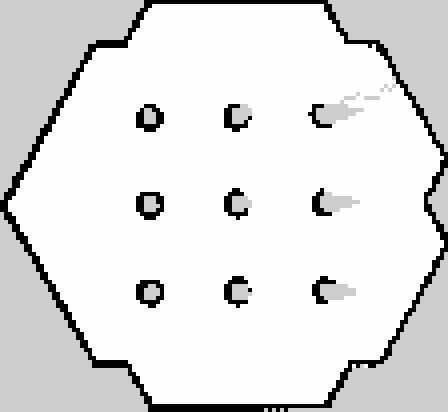

# random_explorer_bot

Autonomous exploration of an unknown indoor world: a TurtleBot3 Burger drives itself to randomly sampled, collision-checked goals while SLAM builds a map of everything it sees — fully simulated in Gazebo Harmonic, no hardware required.



*SLAM occupancy grid after autonomous exploration of the TurtleBot3 world — hexagonal outer wall and all nine cylindrical obstacles mapped (0.05 m/cell). Black = wall, grey = unknown, white = free.*

---

## 1. What it does

A single C++ node (`exploration_controller`) picks random reachable goals inside the
known map, sends them to Nav2 as `NavigateToPose` actions, and lets `slam_toolbox`
map the world as the robot drives. Goals that occupy or sit too close to an obstacle
are rejected before they are ever sent; goals that Nav2 cannot reach within a timeout
are cancelled and replaced. The robot explores indefinitely with no human input.

## 2. Node graph

```
                Gazebo Harmonic (gz-sim8)
                ┌────────────────────────┐
                │  explore_world.sdf      │
                │  TB3 Burger: diff-drive │
                │  + gpu_lidar + imu      │
                └───────────┬─────────────┘
                            │ gz-transport
                   ┌────────┴─────────┐
                   │  ros_gz_bridge   │  /clock /scan /odom /tf /imu  (GZ→ROS)
                   │ (parameter_bridge)│  /cmd_vel                    (ROS→GZ)
                   └────────┬─────────┘
            /scan /tf  ┌────┴───────────────────────────┐  /tf (map→odom)
                  ┌────▼─────┐                     ┌─────▼──────────────┐
                  │slam_toolbox│  /map ─────────►  │ exploration_controller │
                  │  (sync)   │                    │  (this package, C++)   │
                  └────┬──────┘                    │  • RandomGoalGenerator │
            /map(costmap)│                         │  • MapValidator        │
                  ┌─────▼───────────────────────┐  │  • tf2 map→base_link   │
                  │           Nav2               │  └───────┬────────────────┘
                  │ planner → controller →       │   navigate_to_pose (action)
                  │ velocity_smoother → /cmd_vel │◄─────────┘
                  │ (lifecycle: autostart)       │
                  └──────────────────────────────┘
                         │ /exploration_goal_marker → RViz2
```

tf chain: `map`→`odom` (slam_toolbox) → `base_footprint` (gz diff-drive) →
`base_link`/`base_scan` (robot_state_publisher).
cmd_vel chain: `controller_server` → `/cmd_vel_nav` → `velocity_smoother` →
`/cmd_vel` → `ros_gz_bridge` → DiffDrive plugin.

## 3. Key decisions

- **Goal logic in C++, not Python.** Goal sampling + occupancy-grid clearance checks
  run in the perception/planning hot path; C++ keeps `MapValidator`'s per-cell circular
  clearance scan cheap enough to run every cycle without stalling callbacks.
- **`slam_toolbox` + `navigation_launch.py` (no AMCL/map_server).** The map is unknown
  at start, so localization comes from SLAM's `map`→`odom` tf, not AMCL. Pose is read
  via a `tf2` `map`→`base_link` lookup — an earlier version subscribed to `/amcl_pose`,
  which never publishes under SLAM, so every goal distance was measured from `(0,0)`.
- **Gazebo Harmonic (gz-sim8), not Classic.** Gazebo Classic is EOL and has no binaries
  on this machine; the whole sim (world, diff-drive, gpu_lidar, imu, bridge) is
  self-contained in this package so it runs from a clean checkout.
- **Pre-send validity filtering.** Goals are clearance-checked (0.35 m circular) against
  the live occupancy grid *before* dispatch, so Nav2 is never handed goals inside the
  nine cylinders — cutting wasted planning cycles.
- **Timed staged bringup.** Sim starts first; SLAM/Nav2 wait 8 s and the explorer waits a
  further 10 s, so `/scan`, `/odom`, and tf are flowing before the nav stack initializes
  (avoids the lifecycle-not-active and tf-startup-race footguns).

## 4. Dependencies

**Build:** `ament_cmake`, C++17.
**ROS 2 Humble packages:** `rclcpp`, `rclcpp_action`, `nav2_msgs`, `geometry_msgs`,
`nav_msgs`, `sensor_msgs`, `action_msgs`, `tf2`, `tf2_ros`, `tf2_geometry_msgs`,
`visualization_msgs`.
**Runtime stack:** `nav2_bringup`, `slam_toolbox`, `robot_state_publisher`, `xacro`,
`ros_gz_sim`, `ros_gz_bridge`, `rviz2`.
**Simulator:** Gazebo Harmonic (gz-sim8).

## 5. Build & launch

```bash
# Symlinked into the colcon workspace, then built:
cd ~/ros2_ws
colcon build --packages-select random_explorer_bot --symlink-install
source install/setup.bash

# One-shot demo: Gazebo + bridge + SLAM + Nav2 + RViz + explorer
ros2 launch random_explorer_bot explore_world.launch.py
```

> **Operational footgun:** always `pkill -9 -f "gz sim"` before relaunching. A leftover
> headless `gz sim` server shares the global gz-transport bus and silently corrupts
> `/clock`, `/odom`, and `/tf` (clock races to ~100× real time, odom drifts off-world,
> every nav goal becomes invalid). After launch, sanity-check: exactly one `gz sim
> server`, `/clock` ≈ wall time, odom near the spawn at `(-2.0, -0.5)`.

Save the live SLAM map at any time:

```bash
ros2 run nav2_map_server map_saver_cli -f docs/explored_map
```

## 6. Demo

Hero artifact is the SLAM occupancy grid above (`docs/explored_map.png`), saved live
from a running session — it shows the full TurtleBot3 world reconstructed from the
robot's own laser scans.

<!-- Live GIF: record with the windows foregrounded, then commit docs/demo.gif:
ffmpeg -f x11grab -framerate 15 -video_size <W>x<H> -i :0.0+<X>,<Y> -t 12 /tmp/demo.mp4
ffmpeg -i /tmp/demo.mp4 -vf "fps=10,scale=600:-1:flags=lanczos,palettegen" /tmp/p.png
ffmpeg -i /tmp/demo.mp4 -i /tmp/p.png -lavfi "fps=10,scale=600:-1[x];[x][1:v]paletteuse" docs/demo.gif
RViz (map + colored goal-arrow markers) is the best view to capture. -->

## 7. Measured results

Captured from a live ~18-minute exploration run (`explore_world.launch.py`, RTF ≈ 1,
single gz instance):

| Metric | Value |
|---|---|
| Goals dispatched | 66 |
| Goals reached | 38 |
| Goals aborted (Nav2 abort / 60 s timeout) | 26 |
| Success rate (of decided goals) | **59 %** |
| Mean time-to-goal (reached) | 12.2 s (range 3.6–24.0 s) |
| Mean goal distance | 2.11 m (range 1.02–4.02 m) |
| Map resolution | 0.05 m/cell |
| Coverage | full arena: outer wall + all 9 cylinders (see map) |

The 41 % abort rate is the honest limitation of **uniform random** goal sampling: in a
~4.6 m arena packed with nine cylinders, many sampled points are technically free but
boxed in by obstacles, so Nav2 plans, struggles, and times out. This is the motivation
for the roadmap below.

## 8. Planned improvements

- **Frontier-based exploration.** `RandomGoalGenerator::generateFrontierBiasedGoal()`
  already exists but is unused — the controller calls pure-random `generateGoal()`.
  Wire it in (drive toward known/unknown map boundaries) to push the >59 % success rate
  up and cut aborts in obstacle-dense regions.
- **Coverage-aware termination.** Stop or report "done" when the explored free-cell area
  stops growing, instead of exploring forever.
- **Replace the wall-clock goal timeout** with a Nav2-progress check (cancel on
  *stalled* progress, not just elapsed time) so slow-but-valid goals aren't dropped.
- **Record and commit `docs/demo.gif`** (RViz map-growth + goal markers) for portfolio
  submission — see the commented recipe in §6.
- **Launch-time cleanup of stray gz servers** so the operational footgun in §5 can't
  bite on relaunch.
```
